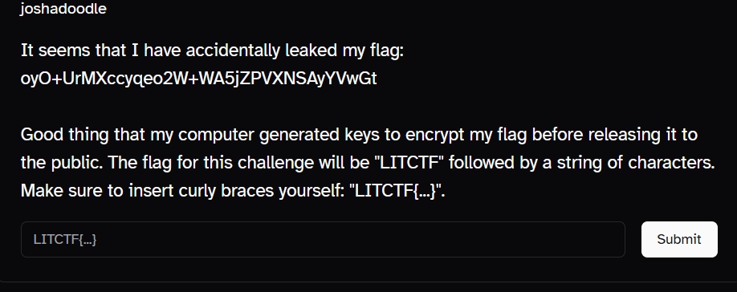
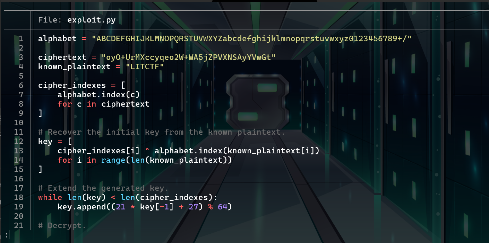
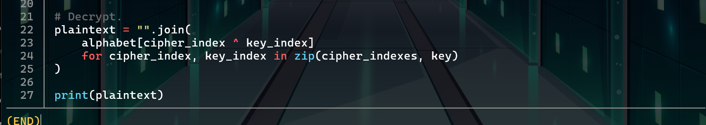

**Category:** `Crypto`  
**Challenge:** `Extremely Original`  
**CTF:** `LITCTF`

---

## Challenge

The challenge gave us this leaked string:

```text
oyO+UrMXccyqeo2W+WA5jZPVXNSAyYVwGt
```

along with this description:

> It seems that I have accidentally leaked my flag:
>
> `oyO+UrMXccyqeo2W+WA5jZPVXNSAyYVwGt`
>
> Good thing that my computer generated keys to encrypt my flag before releasing it to the public.
>
> The flag for this challenge will be `LITCTF` followed by a string of characters.
> Make sure to insert curly braces yourself: `LITCTF{...}`.



*Figure 1: The original `Extremely Original` challenge.*

My first thought was pretty simple: the leaked string looks a lot like `Base64`.

So naturally I tried thinking about it as normal Base64 data first.

That did not lead to a readable flag.

At that point, I stopped focusing on **decoding Base64** and instead started looking at the **Base64 alphabet itself**.

That small change in perspective ended up being the key to the challenge.

---

## The clue hidden in the description

The most useful part of the challenge description is this:

```text
The flag for this challenge will be "LITCTF" followed by a string of characters.
Make sure to insert curly braces yourself.
```

The second sentence is especially important.

It means that the actual encrypted plaintext begins with:

```text
LITCTF
```

and not:

```text
LITCTF{
```

The curly braces are only supposed to be added after we recover the plaintext.

So before doing any cryptanalysis, we already know the first six plaintext characters:

```text
LITCTF
```

That gives us a piece of **known plaintext**.

And known plaintext becomes very useful when `XOR` is involved.

---

## Treating Base64 characters as numbers

The ciphertext only contains characters from the normal Base64 alphabet:

```text
ABCDEFGHIJKLMNOPQRSTUVWXYZabcdefghijklmnopqrstuvwxyz0123456789+/
```

There are exactly `64` characters in this alphabet.

That means every character can be represented by a number from `0` to `63`.

For example:

```text
A -> 0
B -> 1
C -> 2
...
Z -> 25

a -> 26
b -> 27
...
z -> 51

0 -> 52
...
9 -> 61

+ -> 62
/ -> 63
```

In Python, I used:

```python
alphabet = "ABCDEFGHIJKLMNOPQRSTUVWXYZabcdefghijklmnopqrstuvwxyz0123456789+/"
```

Then a character can be converted to its index with:

```python
alphabet.index(character)
```

So instead of looking at:

```text
oyO+UrMX...
```

as just a string, I could work with the numeric values behind each character.

---

## Recovering the beginning of the key

We know the ciphertext starts with:

```text
oyO+Ur
```

and the plaintext starts with:

```text
LITCTF
```

If the encryption is based on:

```text
ciphertext = plaintext XOR key
```

then we can reverse it using:

```text
key = ciphertext XOR plaintext
```

That works because XOR is reversible.

First, I converted the ciphertext prefix into Base64 indexes:

```text
o -> 40
y -> 50
O -> 14
+ -> 62
U -> 20
r -> 43
```

Then I converted our known plaintext `LITCTF`:

```text
L -> 11
I -> 8
T -> 19
C -> 2
T -> 19
F -> 5
```

Now XOR each pair:

```text
40 ^ 11 = 35
50 ^  8 = 58
14 ^ 19 = 29
62 ^  2 = 60
20 ^ 19 =  7
43 ^  5 = 46
```

So the first six key values are:

```text
35, 58, 29, 60, 7, 46
```

Converting those values back into Base64 characters gives:

```text
j6d8Hu
```

That means just six known plaintext characters were enough to recover the beginning of the key.

This was the first real breakthrough.

---

## Finding the pattern

Now I had these key values:

```text
35, 58, 29, 60, 7, 46
```

One thing immediately stood out: every value stays between `0` and `63`.

Since the Base64 alphabet contains `64` characters, I suspected that the key generator was working modulo `64`.

A simple generator could have the form:

```text
next = (a * current + b) mod 64
```

I could have tried guessing `a` and `b`, but there are only `64 × 64` possibilities, so it was easier to let Python test all of them.

```python
known_key = [35, 58, 29, 60, 7, 46]

for a in range(64):
    for b in range(64):
        valid = True

        for i in range(len(known_key) - 1):
            predicted = (a * known_key[i] + b) % 64

            if predicted != known_key[i + 1]:
                valid = False
                break

        if valid:
            print(a, b)
```

The script gave:

```text
21 27
```

So the key generator is:

```text
next = (21 * current + 27) mod 64
```

I also checked it manually.

Starting from `35`:

```text
(21 * 35 + 27) mod 64
= 762 mod 64
= 58
```

Then from `58`:

```text
(21 * 58 + 27) mod 64
= 1245 mod 64
= 29
```

Those are exactly the next values from the recovered key.

So now I wasn't limited to the first six key characters anymore.

I could generate the entire keystream.

---


*At this point, the challenge suddenly started making a lot more sense.*

---

## Writing the solver

Once I had the recurrence, the rest of the solve was pretty direct.

The plan was:

1. Convert the ciphertext into Base64 indexes.
2. Use the known plaintext `LITCTF` to recover the start of the key.
3. Extend that key using the recurrence.
4. XOR the complete key with the ciphertext.
5. Convert the resulting values back into characters.

Here is the first part of the script I used:



*Figure 2: Recovering the initial key values and extending the generated keystream.*

The main setup is:

```python
alphabet = "ABCDEFGHIJKLMNOPQRSTUVWXYZabcdefghijklmnopqrstuvwxyz0123456789+/"

ciphertext = "oyO+UrMXccyqeo2W+WA5jZPVXNSAyYVwGt"
known_plaintext = "LITCTF"
```

First, convert the ciphertext characters into indexes:

```python
cipher_indexes = [
    alphabet.index(c)
    for c in ciphertext
]
```

Then recover the beginning of the key:

```python
key = [
    cipher_indexes[i] ^ alphabet.index(known_plaintext[i])
    for i in range(len(known_plaintext))
]
```

Finally, extend the key with the recurrence we discovered:

```python
while len(key) < len(cipher_indexes):
    key.append((21 * key[-1] + 27) % 64)
```

This generates the complete key:

```text
j6d8HuhQrilkPWp4zKtMX+xg7y10fm5IDa
```

Now there is one key value for every ciphertext character.

---

## Decrypting the ciphertext

The final step is simply reversing the XOR.

For each position:

```text
plaintext_index = ciphertext_index XOR key_index
```

Then I convert that resulting value back into a character from the same Base64 alphabet.

In Python:

```python
plaintext = "".join(
    alphabet[cipher_index ^ key_index]
    for cipher_index, key_index in zip(cipher_indexes, key)
)

print(plaintext)
```

Here is the last part of my solver:



*Figure 3: XORing the generated key with the ciphertext to recover the plaintext.*

Running the script gives:

```text
LITCTFtH3+XOR+fuNct10n+1s/n0t+s4F3
```

Seeing `LITCTF` appear correctly at the beginning was a nice confirmation that the keystream was correct.

---

## Getting the flag

The recovered plaintext is:

```text
LITCTFtH3+XOR+fuNct10n+1s/n0t+s4F3
```

But the challenge specifically told us:

```text
Make sure to insert curly braces yourself.
```

So after removing the known `LITCTF` prefix, the flag content is:

```text
tH3+XOR+fuNct10n+1s/n0t+s4F3
```

Adding the braces gives:

```text
LITCTF{tH3+XOR+fuNct10n+1s/n0t+s4F3}
```

And that's the flag.

---

## Full solver

Here is the complete script in one place:

```python
alphabet = "ABCDEFGHIJKLMNOPQRSTUVWXYZabcdefghijklmnopqrstuvwxyz0123456789+/"

ciphertext = "oyO+UrMXccyqeo2W+WA5jZPVXNSAyYVwGt"
known_plaintext = "LITCTF"

# Convert the ciphertext into Base64 alphabet indexes.
cipher_indexes = [
    alphabet.index(c)
    for c in ciphertext
]

# Recover the beginning of the key from the known plaintext.
key = [
    cipher_indexes[i] ^ alphabet.index(known_plaintext[i])
    for i in range(len(known_plaintext))
]

# Extend the keystream using the discovered recurrence.
while len(key) < len(cipher_indexes):
    key.append((21 * key[-1] + 27) % 64)

# Decrypt the ciphertext.
plaintext = "".join(
    alphabet[cipher_index ^ key_index]
    for cipher_index, key_index in zip(cipher_indexes, key)
)

print(plaintext)
```

Output:

```text
LITCTFtH3+XOR+fuNct10n+1s/n0t+s4F3
```

Final flag:

```text
LITCTF{tH3+XOR+fuNct10n+1s/n0t+s4F3}
```

---

## What I took away from this challenge

What I liked about this challenge was that the ciphertext immediately pushes you toward thinking about ordinary `Base64`.

But Base64 decoding wasn't really the important part.

The important idea was using the Base64 alphabet as a set of values from `0` to `63`.

Then the challenge gave away an even bigger clue:

```text
LITCTF
```

Because those six plaintext characters were already known, I could recover the first six XOR key values.

Those values exposed the recurrence:

```text
next = (21 * current + 27) mod 64
```

And once the key generator became predictable, the rest of the keystream could be reconstructed.

The main lesson I took from it is:

> `XOR` was not the real weakness here. The predictable way the key was generated was.

A small amount of known plaintext was enough to turn the whole encryption scheme against itself.